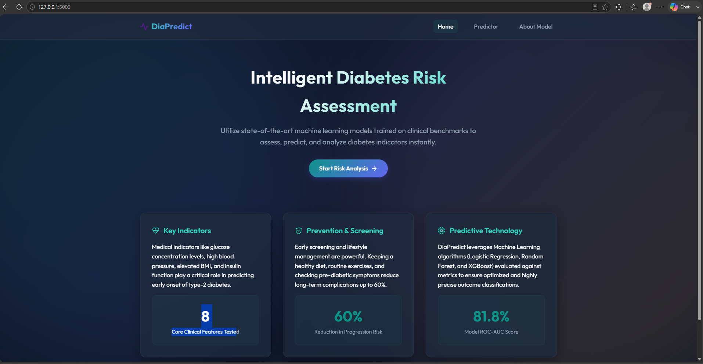

# Diabetes Prediction System (DiaPredict)

DiaPredict is an end-to-end Machine Learning web application designed to predict whether a patient has diabetes based on medical parameters from the Pima Indians Diabetes Dataset. The model achieves an ROC-AUC of **81.8%** using a Random Forest classifier.



---

## Project Structure

```text
diabetes-prediction-system/
│
├── dataset/
│   └── diabetes.csv        # Local cached dataset
│
├── notebooks/
│   └── EDA.ipynb           # Jupyter notebook for exploratory data analysis
│
├── model/
│   ├── train.py            # Model training & comparison script
│   ├── predict.py          # Pre-processing, inference & risk classification wrapper
│   └── diabetes_model.pkl  # Serialized model, scaler, and imputation medians
│
├── templates/
│   ├── index.html          # Landing / Home page
│   ├── predict.html        # Patient diagnostics & results interface
│   └── about.html          # About the dataset and model metrics
│
├── static/
│   ├── css/
│   │   └── style.css       # Custom stylesheets (glassmorphism UI)
│   └── js/
│       └── script.js       # Client validations & Fetch API integration
│
├── app.py                  # Flask web backend application
│
├── requirements.txt        # Project python packages
│
├── Dockerfile              # Container configuration
│
└── docker-compose.yml     # Compose configuration
```

---

## Machine Learning Pipeline

1. **Ingestion & Validation**:
   - Downloads the Pima Indians Diabetes Dataset from clinical repositories.
   - Inspects for null values, duplicates, and data type issues.
2. **Data Imputation & Preprocessing**:
   - Zero-values in fields like `Glucose`, `BloodPressure`, `SkinThickness`, `Insulin`, and `BMI` are treated as missing/invalid and imputed with stratified medians calculated strictly from the training set.
3. **Scaling**:
   - Features scaled with `StandardScaler` to bring inputs to uniform mean and unit variance.
4. **Model Selection**:
   - Trains Logistic Regression, Random Forest, and XGBoost.
   - Compares Accuracy, Precision, Recall, F1 Score, and ROC-AUC.
   - The Random Forest model is selected for production due to its optimal ROC-AUC.

---

## Getting Started

### Option 1: Local Installation

1. **Install Dependencies**:
   ```bash
   pip install -r requirements.txt
   ```

2. **Train Model**:
   ```bash
   python model/train.py
   ```

3. **Start Flask Server**:
   ```bash
   python app.py
   ```
   Open `http://127.5.0.1:5000` in your web browser.

### Option 2: Run with Docker

1. **Build and Run (Compose)**:
   ```bash
   docker-compose up --build
   ```

2. **Or Build and Run (Standalone Docker)**:
   ```bash
   docker build -t diabetes-app .
   docker run -p 5000:5000 diabetes-app
   ```
   Open `http://localhost:5000` in your web browser.

---

## API Documentation

### POST `/predict`

**Payload**:
```json
{
  "Pregnancies": 2,
  "Glucose": 120,
  "BloodPressure": 70,
  "SkinThickness": 20,
  "Insulin": 85,
  "BMI": 28.5,
  "DiabetesPedigreeFunction": 0.5,
  "Age": 35
}
```

**Response**:
```json
{
  "prediction": "Diabetic",
  "probability": 0.56,
  "risk_level": "Medium Risk"
}
```

### GET `/health`

**Response**:
```json
{
  "status": "healthy"
}
```
